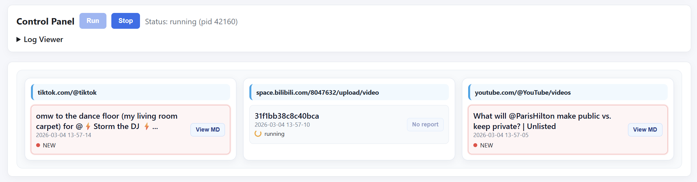
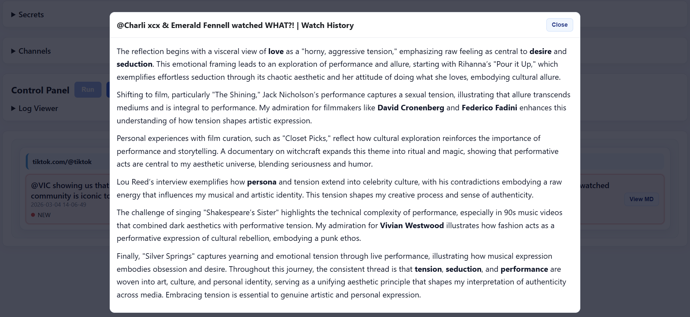
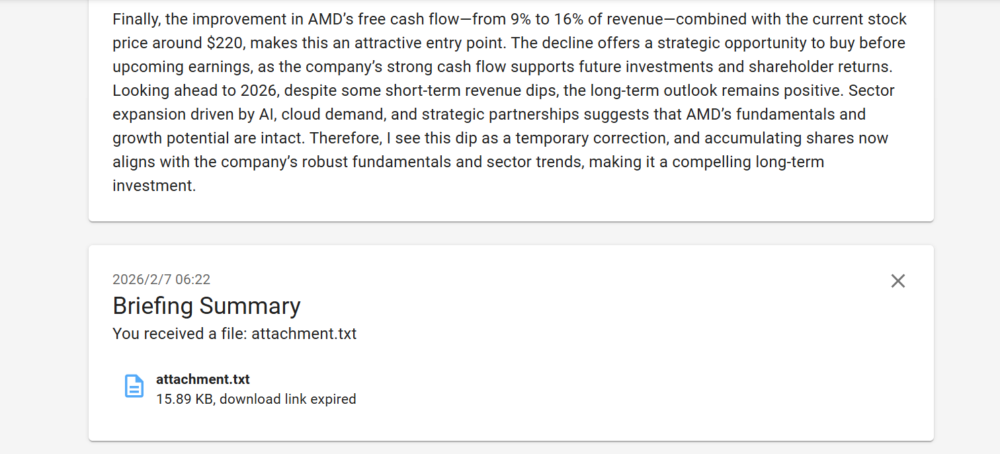
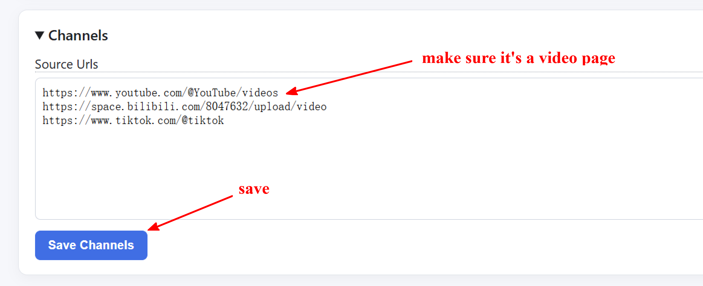

<h1 align="center">📡 Briefing</h1>

<p align="center">
  <strong>Automatically track the creators you follow, summarize their newly published videos, and deliver concise reports.</strong>
</p>

<p align="center">
  <a href="#3-quick-start-no-configuration-required">Quick Start</a> · <a href="README_CN.md">中文文档</a> · <a href="#11-supported-platforms">Supported Platforms</a>
</p>


## 1. Overview

This is a backend service for **automatically tracking the creators you follow** and **summarizing their newly published videos** (including older content).

The system periodically checks whether specified creators have released new videos, automatically performs **download → transcription → content refinement**, and delivers **structured, concise summary reports** to the configured destination.

This enables you to quickly grasp the **core viewpoints and high-frequency insights** from a large volume of creator content in a very short amount of time.

### 1.1 Supported Platforms

| Platform | Support | Notes |
|--------|--------|------|
| 📺 **YouTube** | Supported | Automatic |
| 📺 **Bilibili** | Supported | Automatic |
| 🎵 **TikTok** | Supported | Automatic |
| 📡 **Live Stream Recordings** | Supported via external tool [DouyinLiveRecorder](https://github.com/ihmily/DouyinLiveRecorder) | [See below for details](#12-external-downloader-compatibility) |
| 📕 **Xiaohongshu** | In development | |
| 📕 **Instagram** | In development | |
| 💬 **Douyin** | In development | |
| 📖 **Reddit** | In development | |

### 1.2 External Downloader Compatibility

This project is compatible with external downloaders.

Put audio files in the `briefing/data/audio` directory, or set the downloader’s output directory to `briefing/data/audio`.  
The system will automatically detect and process them.

---

## 2. Feature Preview

### 2.1 Run Panel



### #2.2 GUI Reading Interface



### 2.3 Send Summary to Terminal



---

# 3. Quick Start (No Configuration Required)

### 3.1 Download

Go to [Releases](https://github.com/YutaiGu/briefing/releases/) and download the latest `briefing-vX.X.X-windows.zip`.

> Windows 7 / 8 may require installing [Edge WebView2 Runtime](https://developer.microsoft.com/microsoft-edge/webview2/)

### 3.2 Extract and Run

Extract to any directory and run: `briefing.exe`

### 3.3 API Configuration (Required)

This project relies on external APIs for:

* Content summarization
* Translation
* Text compression

Official OpenAI documentation:

* [https://platform.openai.com/docs/quickstart](https://platform.openai.com/docs/quickstart)

Beginner-friendly tutorial (third-party, OpenAI-compatible API):

* [https://github.com/chatanywhere/GPT_API_free?tab=readme-ov-file#如何使用](https://github.com/chatanywhere/GPT_API_free?tab=readme-ov-file#如何使用)

These resources provide step-by-step guidance on how to obtain an API key and configure it correctly.

### 3.4 Notification Configuration (ntfy)

This project uses **ntfy** as the message delivery channel.

You only need to choose a **unique string** as your topic, for example: `https://ntfy.sh/example123`

Summary reports can be read by opening this URL in a browser.

### 3.5 Source URL Format



- **YouTube**: https://www.youtube.com/@example/videos
- **BiliBili**: https://space.bilibili.com/example/upload/video
- **TikTok**: https://www.tiktok.com/@example

### 3.6 Firefox Cookie Support (Recommend)

If Firefox is installed on this machine and you have previously logged into video sites, the downloader will automatically read cookies from the default Firefox profile to handle videos accessible only after login. No additional configuration is required—simply ensure Firefox has downloaded and used content before starting the service.

## 4. Run From Source (Developers)

Environment requirement: Python 3.10 (Python 3.8 and 3.9 are not supported.)

```bash
git clone https://github.com/YutaiGu/briefing.git
cd briefing
conda create -n briefing python=3.10
conda activate briefing
pip install -r requirements.txt
python launcher.py
```

## 5. Feedback & Contributions

The project is under active development.  
Feedback is welcome — feel free to open an Issue for usage feedback, bug reports, or feature requests.

---

*This project is not affiliated with or endorsed by any third-party downloaders or platforms. Users are responsible for complying with the terms of service of the respective platforms.*