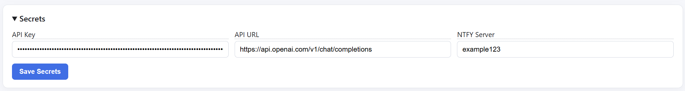

<h1 align="center">📡 Briefing</h1>

<p align="center">
  <strong>自动跟踪订阅的博主，总结视频摘要并推送到端服务</strong>
</p>

<p align="center">
  <a href="#3-快速开始无需配置一键使用">快速开始</a> · <a href="README.md">English Documentation</a> · <a href="#11-当前支持平台">支持平台</a>
</p>


## 1. 功能简介

这是一个用于 **自动跟踪你订阅的博主** 并 **总结其最新发布的视频** (包括往期视频) 的服务。

系统会定期检查指定博主是否有新视频发布，自动完成 **下载 → 转写 → 内容精炼**，并生成 **结构化、简洁的总结报告** 推送到指定接收端。可在极短时间内掌握大量博主输出的 **核心观点与高频信息**。

### 1.1 当前支持平台

| 平台 | 是否支持 | 使用方式 |
|---------|---------|-----------|
| 📺 **YouTube** | 直接支持 | 自动 |
| 📺 **B站** | 直接支持 | 自动 |
| 🎵 **TikTok** | 直接支持 | 自动 |
| 📡 **各大平台直播录制** | 外部下载器支持 [DouyinLiveRecorder](https://github.com/ihmily/DouyinLiveRecorder) | [详见下文](#12-本项目兼容外部下载器) |
| 📕 **小红书** | 开发中 | - |
| 📕 **Instagram** | 开发中 | - |
| 💬 **抖音** | 开发中 | - |
| 📖 **Reddit** | 开发中 | - |

### 1.2 本项目兼容外部下载器
将下载目录/外部音频文件置于`briefing/data/audio`目录，系统将自动检测并处理这些文件。

---

## 2. 功能展示

### 2.1 运行面板


### 2.2 图形化界面阅读


### 2.3 发送总结到终端


---

## 3. 快速开始（无需配置，一键使用）

### 3.1 下载

前往 [Releases](https://github.com/YutaiGu/briefing/releases/)，下载最新版 `briefing-vX.X.X-windows.zip`

> Windows 7/8 或更早期版本需安装[Edge WebView2 Runtime](https://developer.microsoft.com/microsoft-edge/webview2/)

### 3.2 解压并运行

解压到任意目录，双击 `briefing.exe` 即可启动。

### 3.3 API 配置（必须）
本项目依赖API用于：内容总结、翻译、压缩处理



OpenAI官方文档
* [https://platform.openai.com/docs/quickstart](https://platform.openai.com/docs/quickstart)

中文获取教程（国内代理网站）
* [https://github.com/chatanywhere/GPT_API_free?tab=readme-ov-file#如何使用](https://github.com/chatanywhere/GPT_API_free?tab=readme-ov-file#如何使用)

### 3.4 ntfy消息推送配置（可选）
本项目使用 ntfy 作为消息推送通道，只需要想一个自己专属、不会重复的字符串即可：`https://ntfy.sh/example123`

可以通过网页登录此链接的方式阅读报告

### 3.5 主页链接填写方式


- **YouTube**: https://www.youtube.com/@example/videos
- **BiliBili**: https://space.bilibili.com/example/upload/video
- **TikTok**: https://www.tiktok.com/@example

### 3.6 Firefox（推荐）

如果本机安装了 Firefox 并且曾经登录过视频站点，下载器会自动读取默认 Firefox 配置文件的 cookies，用于处理仅登录可见的视频。无需额外配置，启动服务前保持 Firefox 已下载且使用过即可。

## 4. 从源码运行（开发者）

**环境要求**：Python 3.10（不支持 3.8 / 3.9）

```bash
git clone https://github.com/YutaiGu/briefing.git
cd briefing
conda create -n briefing python=3.10
conda activate briefing
pip install -r requirements.txt
python launcher.py
```

## 5. 反馈与贡献

项目持续迭代中，欢迎通过Issues提交：使用反馈 · 问题报告 · 功能建议

---

*本项目与任何第三方下载器及相关平台不存在官方合作或隶属关系。用户需自行遵守各平台服务条款。*